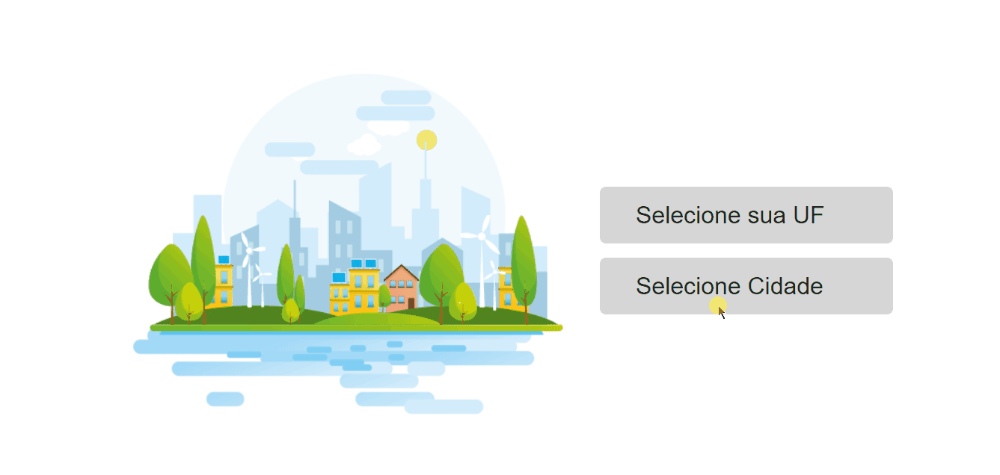

# API DO IBGE

Este projeto consiste em um processo seletivo que recebi de uma empresa, afim de colocar em prática os meus conhecimentos aqui está a versão BETA do projeto, pois será implementado o <strong>REDUX</strong>

## Documentação da API

#### API IBGE

```http
  Padrão GET
```

| Parâmetro   | Tipo       | Descrição                           |
| :---------- | :--------- | :---------------------------------- |
| `api_key` | `string` | **Obrigatório**. https://servicodados.ibge.gov.br/api/v1/localidades/estados/ {municipios}

#### Configure a linguage padrão da sua API


## Aprendizados
Este projeto consiste no consumo da API do IBGE via <strong>Axios</strong>, vale ressaltar que
para ter os municipios será necessãrio a pessoa primeiro escolher o <strong>ESTADO</strong>, É <strong>OBRIGATÓRIO</strong> o municipio apenas aparecer
quando o seu ESTADO for escolhido, para isso poderá usar o USEEFFECT


## 🚀 Sobre mim
Desenvolvedor FrontEnd Freelancer

## Rodando localmente

Clone o projeto

```bash
  git clone https://link-para-o-projeto
```

Entre no diretório do projeto

```bash
  cd my-project
```

Instale as dependências - Criado com <strong>VITE E TYPESCRIPT</strong>

```bash
  npm install
  ou 
  Yarn (Em meu projeto foi utilizado Yarn)
```

Inicie o servidor

```bash
 npm start 
 or 
 Yarn dev
```


## Melhorias

Próxima Sprint será inserido no projeto REDUX




## Suporte

Para suporte, mande um email para joaodevelopment7@gmail.com ou através do meu Linkedin

